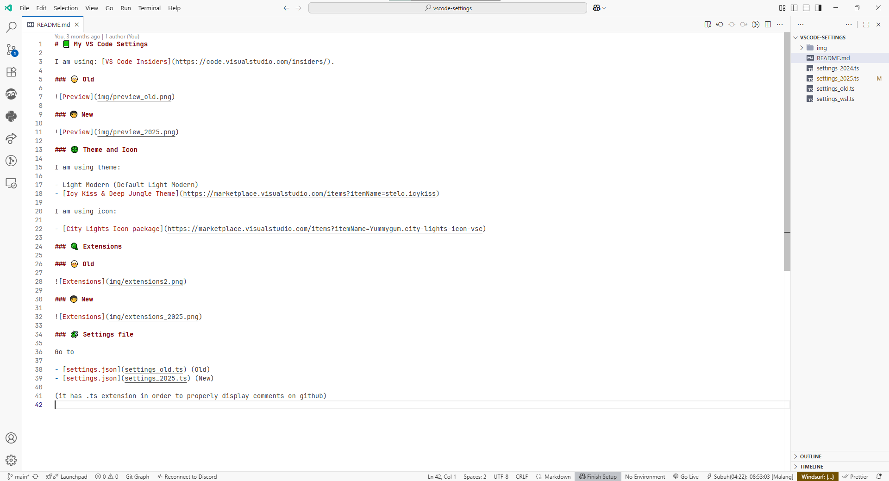
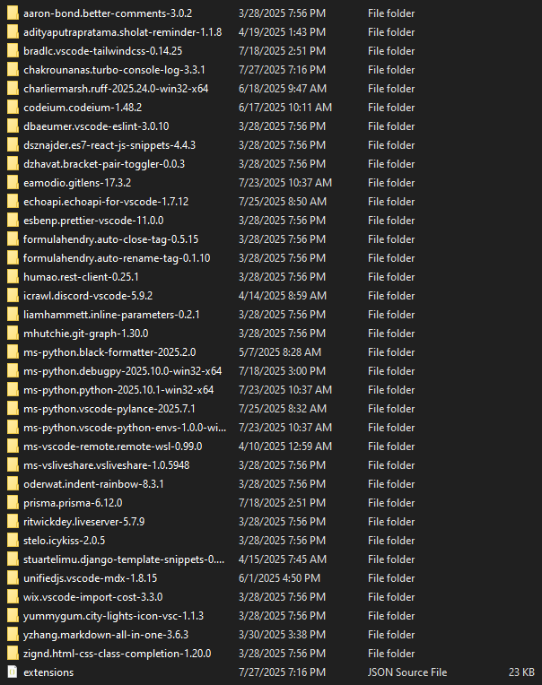

# 📗 My VS Code Settings

I am using: [VS Code Insiders](https://code.visualstudio.com/insiders/).

### 🧓 Old

### 👨‍🦱 New

### 🍀 Theme and Icon

I am using theme:

- Light Modern (Default Light Modern)
- [Icy Kiss & Deep Jungle Theme](https://marketplace.visualstudio.com/items?itemName=stelo.icykiss)

I am using icon:

- [City Lights Icon package](https://marketplace.visualstudio.com/items?itemName=Yummygum.city-lights-icon-vsc)

### 🧶 Extensions

### 🧓 Old

### 👨‍🦱 New

### 🧩 Settings file

Go to

- [settings.json](settings_old.ts) (Old)
- [settings.json](settings_2025.ts) (New)

(it has .ts extension in order to properly display comments on github)
