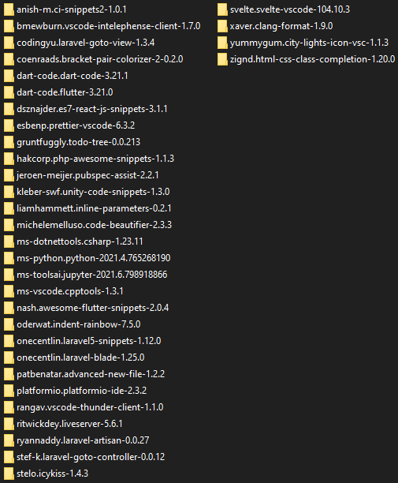

# 📗 My VSCode Settings

I am using: [VSCode Insiders](https://code.visualstudio.com/insiders/).

### 🍀 Theme

I am using theme: [Icy Kiss & Deep Jungle Theme](https://marketplace.visualstudio.com/items?itemName=stelo.icykiss).

### 🧶 Extensions

### 🧩 Settings file

Go to

- [settings.json](settings.ts)

(it has .ts extension in order to properly display comments on github)
